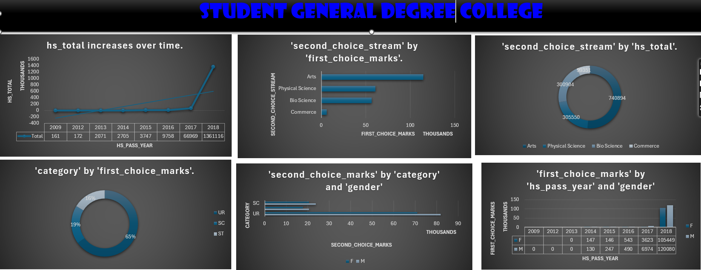

# Student General Degree College Dashboard

## Purpose
The dashboard provides an overview of the student enrollment and performance trends at the Student General Degree College over the years. It covers key metrics such as total enrollment, student stream preferences, category-wise enrollment, and first-choice marks.

## Key Metrics
1. **hs_total increases over time**: This graph shows the total student enrollment at the college has been increasing steadily over the years.
2. **'second choice stream' by 'first_choice_marks'**: This chart displays the distribution of students' second-choice stream preferences based on their first-choice marks. It provides insights into the academic performance and stream preferences of the students.
3. **'second_choice_stream' by 'hs_total'**: This pie chart breaks down the distribution of students' second-choice stream preferences (Arts, Physical Science, Bio Science, and Commerce) in relation to the total student enrollment.
4. **'category' by 'first_choice_marks'**: This pie chart shows the enrollment distribution across different categories (General, SC, ST) based on students' first-choice marks.
5. **'second_choice_marks' by 'category' and 'gender'**: This chart presents the distribution of students' second-choice marks across different categories (General, SC, ST) and genders (M, F).
6. **'first_choice_marks' by 'hs_pass_year' and 'gender'**: This graph depicts the trend of students' first-choice marks over the years, categorized by gender.

## Insights
1. The total student enrollment at the college has been steadily increasing over the years, indicating a growing demand for higher education in the region.
2. The majority of students choose Physical Science as their second-choice stream, followed by Bio Science and Commerce, suggesting a strong interest in the sciences among the student population.
3. The enrollment distribution across different categories (General, SC, ST) is relatively balanced, with the General category having the highest representation.
4. Female students have consistently outperformed their male counterparts in terms of first-choice marks, indicating a positive trend in female academic achievement.

## Analysis
The dashboard provides a comprehensive overview of the student enrollment and performance trends at the Student General Degree College. The insights gained from this data can be used to:
- Identify areas of strength and potential improvement in the college's academic programs.
- Develop targeted strategies to attract and retain students from diverse backgrounds.
- Implement measures to support and encourage female students' academic success.
- Analyze the factors influencing students' stream preferences and academic performance.
- Inform decision-making processes related to resource allocation, curriculum development, and student support services.
